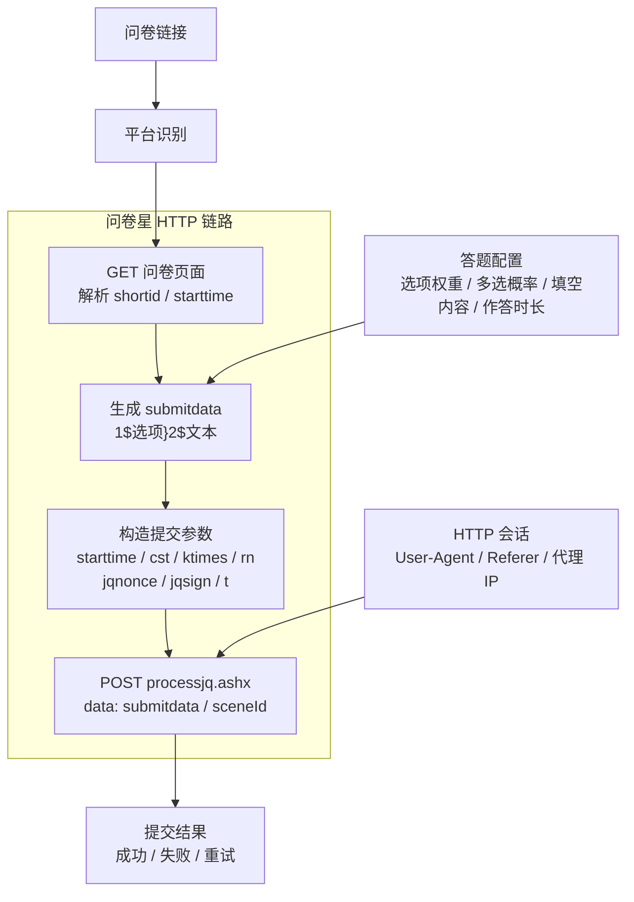

<div align="center">
  <h1>SurveyController</h1>

  [](https://www.python.org/)
  [](./LICENSE)

  <p><strong>问卷星自动化填答工具，基于纯 HTTP 提交</strong></p>
  <p>支持自定义答案比例、信效度分析、作答时长控制、AI 主观题作答</p>

</div>

> [!WARNING]
> **该项目仅供 HTTP 接口自动化学习与测试使用。** 请确保拥有目标测试问卷的授权再使用，**严禁污染他人问卷数据！**

---

## 主要特性

1. **CLI + YAML 配置** - 命令行运行，YAML 文件定义问卷参数，方便自动化与复现
2. **纯 HTTP 提交** - 无需浏览器，直接构造请求提交问卷
3. **定制答案比例** - 自定义各选项权重与多选题命中概率分布
4. **信效度分析** - 内置 Cronbach's Alpha 系数控制与反向题处理
5. **AI 主观题作答** - 通过自定义 OpenAI 兼容端点自动生成填空题内容
6. **反向填充** - 支持从已有数据反向生成答案配置
7. **作答时长控制** - 模拟真实作答时长分布

## 开始使用

**环境要求：** Python 3.13.14+，Git，uv

```bash
git clone https://github.com/kaixinol/SurveySubmitter.git
cd SurveySubmitter
uv sync
```

复制示例配置并编辑：

```bash
cp config.example.yaml config.yaml
# 编辑 config.yaml，填入问卷链接和答题配置
```

运行：

```bash
uv run python cli.py run config.yaml
```

仅解析问卷结构（不提交）：

```bash
uv run python cli.py run config.yaml --parse-only
```

## 关键配置说明

配置文件采用 YAML 分区格式（`survey` / `execution` / `answer_config`）：

| 配置项 | 说明 |
|--------|------|
| `survey.url` | 问卷星问卷链接 |
| `execution.target_num` | 计划提交份数 |
| `execution.num_threads` | 并发线程数 |
| `execution.ai` | AI 填空配置（api_key / base_url / model） |
| `execution.random_proxy_ip` | 是否启用随机代理 IP |
| `execution.random_user_agent` | 是否启用随机 User-Agent |
| `execution.reverse_fill` | 反向填充配置 |
| `answer_config.question_entries` | 各题答案权重与概率分布 |

完整配置项参见 `config.example.yaml`。

## 技术架构



## 参与贡献

欢迎提交 Pull Request，改进方向包括但不限于：
- 增加对更多题型的支持
- 性能优化与代码重构
- 测试覆盖完善

详见 [贡献指南](CONTRIBUTING.md)。

## 贡献者

感谢以下贡献者对本项目的支持：

<div style="display: flex; gap: 10px;">
  <a href="https://github.com/shiaho777">
    
  </a>
  <a href="https://github.com/BingBuLiang">
    
  </a>
  <a href="https://github.com/dAwn-Rebirth">
    
  </a>
  <a href="https://github.com/Moyuin-aka">
    
  </a>
  <a href="https://github.com/zioug">
    
  </a>
  <a href="https://github.com/qintaiyang">
    
  </a>
  <a href="https://github.com/LING71671">
    
  </a>
</div>
