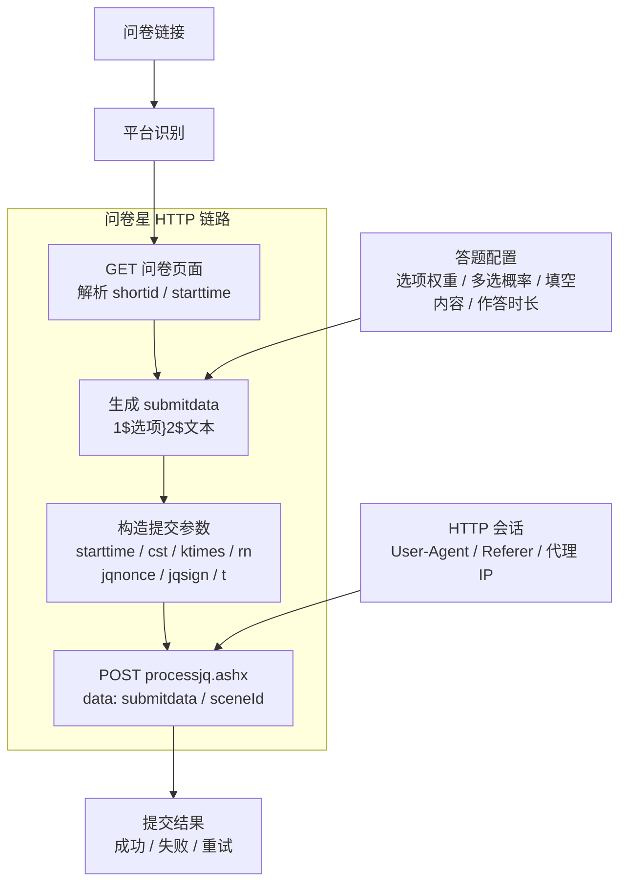

<div align="center">
  <h1>SurveySubmitter</h1>

  [](https://www.python.org/)
  [](./LICENSE)

  <p><strong>问卷星自动化填答工具，基于纯 HTTP 提交</strong></p>
  <p>支持自定义答案比例、信效度分析、作答时长控制、AI 主观题作答</p>

</div>

> [!CAUTION]
> **本仓库已不再维护。** 历史遗留代码债过重（俗称「屎山」），继续维护的收益低于推倒重写。
> 如需图形界面或多平台（腾讯问卷 / Credamo 见数）支持，请使用上游 [SurveyController](https://github.com/SurveyController/SurveyController)。

> [!WARNING]
> **该项目仅供 HTTP 接口自动化学习与测试使用。** 请确保拥有目标测试问卷的授权再使用，**严禁污染他人问卷数据！**

---

## 与上游仓库的差异

上游为 [SurveyController](https://github.com/SurveyController/SurveyController)。本仓库自上游快照导入（初始提交 `57ecb3c9`，2026-07-12）后独立演进，下表以 **上游当前 `main`（`1a22ba36`）** 为基准对比。

### 新增功能

| 功能                         | 说明                                                                                                                                         |
| ---------------------------- | -------------------------------------------------------------------------------------------------------------------------------------------- |
| CLI + YAML 配置驱动          | 以 `cli.py run config.yaml` 运行，参数全部集中在 YAML，取代可视化操作                                                                        |
| `test_profiles` 固定答案     | 按轮次切换固定答案，便于定向测试                                                                                                             |
| `random_value_pool` 随机值池 | 地区 / 高校题从指定候选值池随机取值                                                                                                          |
| 高校题型一等支持             | `QuestionType.UNIVERSITY` 可独立识别与作答                                                                                                   |
| 代理 `local` 源              | 代理列表支持本地文件或 http(s) 链接，并校验连通性                                                                                            |
| CLI 增强                     | `--dry-run` 解析配置文件中的问卷并校验执行配置（不提交）；`--url <链接>` 解析问卷并输出题目内容与跳题 / 显隐规则；`--log-level` 控制日志级别 |
| 纯 HTTP 提交                 | 不依赖浏览器；上游当前 `main` 亦无浏览器依赖，是否为本仓库独有 **待确认**                                                                    |

### 移除 / 缺失功能

| 功能                | 说明                                                                                  |
| ------------------- | ------------------------------------------------------------------------------------- |
| 腾讯问卷平台        | 上游 `tencent/` 为完整 provider，本仓库仅保留问卷星                                   |
| Credamo 见数平台    | 上游 `credamo/` 为完整 provider，本仓库未保留                                         |
| Fluent 图形界面     | 上游 `software/app/` 提供 GUI，本仓库改为 CLI                                         |
| 二维码解析          | 上游支持拖入二维码图片自动转链接                                                      |
| Windows 安装包      | 上游提供 `Setup/` 与 releases 的 .exe 发行版                                          |
| 付费功能体系        | 上游 AI 等功能含付费 / 限时免费，本仓库已移除                                         |
| 人格画像（persona） | 上游保留 persona 生成器，本仓库已移除（下方特性列表未同步）                           |
| 心理测量模块        | 上游 CI 仍保留 `psychometrics` 相关测试，本仓库已删除 `joint_optimizer` 等 **待确认** |
| 本地凭据存储        | 上游 `settings_store` 持久化用户配置，本仓库已删除                                    |

### 行为与配置变更

| 项            | 变更                                                                                                             |
| ------------- | ---------------------------------------------------------------------------------------------------------------- |
| 配置结构      | `ExecutionConfig` 由平铺字段改为语义分组嵌套（`survey` / `control` / `network` / `ai` 等），**不兼容旧配置文件** |
| 代理配置      | 迁移至 `execution.proxy.*`，由 `enabled` 控制                                                                    |
| 运行时状态    | `proxy_ip_pool`、`current_profile_index` 移出配置，改为运行时状态                                                |
| 题型标识      | `is_university` 等布尔标志改为 `QuestionType.UNIVERSITY` 与 `QuestionSignal` 集合                                |
| AI 接入       | 简化为仅自定义 OpenAI 兼容端点                                                                                   |
| 包名与入口    | `SurveyController` → `surveysubmitter`，入口 `SurveyController.py` → `cli.py`                                    |
| 类型检查 / CI | pyright → ty；CI 仅保留 Linux                                                                                    |

<details>
<summary><b>代码重构（不影响功能）</b></summary>

- 项目结构改为 src layout，模块按职责重新划分
- 问卷星 HTML 解析器用 lxml + XPath 规则表重写，移除 BeautifulSoup
- 配置系统迁移到 Pydantic v2，`SurveyQuestionMeta` 拆为子类层次
- 题型枚举统一为单一 `QuestionType`，合并历史 `TypeCode` 别名
- 拆分 God Module 与多个超长函数，清理 PyQt / 浏览器驱动残留死代码
- 删除 `version.py`、`settings_store`、`runtime_paths` 等遗留模块，合并碎片化文件

</details>

---

## 主要特性

1. **CLI + YAML 配置** - 命令行运行，YAML 文件定义问卷参数，方便自动化与复现
2. **纯 HTTP 提交** - 无需浏览器，直接构造请求提交问卷
3. **定制答案比例** - 自定义各选项权重与多选题命中概率分布
4. **信效度分析** - 内置 Cronbach's Alpha 系数控制与反向题处理
5. **AI 主观题作答** - 通过自定义 OpenAI 兼容端点自动生成填空题内容
6. **反向填充** - 支持从已有数据反向生成答案配置
7. **作答时长控制** - 模拟真实作答时长分布
8. **人格画像** - 模拟不同人格特征的作答倾向
9. **固定答案提交** - 通过 `test_profiles` 按轮次切换固定答案，适合特定场景测试
10. **高校/地区题支持** - 内置高校与地区题型识别，支持 `random_value_pool` 随机值池

## 开始使用

**环境要求：** Python 3.13.14+，Git，uv

```bash
git clone https://github.com/kaixinol/SurveySubmitter.git
cd SurveySubmitter
uv sync
```

复制示例配置并编辑：

```bash
cp config.example.yaml config.yaml
# 编辑 config.yaml，填入问卷链接和答题配置
```

运行：

```bash
uv run python cli.py run config.yaml
```

按配置文件试运行：解析配置中的问卷并校验执行配置，不提交：

```bash
uv run python cli.py run config.yaml --dry-run
```

直接解析问卷链接（无需配置文件），输出题目内容与跳题 / 显隐规则：

```bash
uv run python cli.py --url "https://www.wjx.cn/s/your-survey-id.aspx"
```

指定日志级别：

```bash
uv run python cli.py run config.yaml --log-level DEBUG
```

## 关键配置说明

配置文件采用 YAML 分区格式（`survey` / `execution` / `answer_config`）：

| 配置项                           | 说明                                                                                         |
| -------------------------------- | -------------------------------------------------------------------------------------------- |
| `survey.url`                     | 问卷星问卷链接                                                                               |
| `survey.provider`                | 平台标识（`wjx` 或 auto-detect）                                                             |
| `execution.target_num`           | 计划提交份数                                                                                 |
| `execution.num_threads`          | 并发线程数                                                                                   |
| `execution.ai`                   | AI 填空配置（api_key / base_url / model）                                                    |
| `execution.reliability_mode`     | 可靠性模式                                                                                   |
| `execution.persona`              | 人格画像模拟                                                                                 |
| `execution.proxy.enabled`        | 是否启用代理（`execution.proxy` 含 `source`/`custom_api_url`/`ip_list`/`area_code`/`reuse`） |
| `execution.proxy.source`         | 代理源：`custom`（自定义API地址）或 `local`（仅本地静态列表）                                |
| `execution.proxy.reuse`          | 是否允许复用 IP（已用/占用的代理归还到池中循环使用）                                         |
| `execution.random_user_agent`    | 是否启用随机 User-Agent                                                                      |
| `execution.reverse_fill`         | 反向填充配置                                                                                 |
| `answer_config.question_entries` | 各题答案权重与概率分布                                                                       |
| `answer_config.test_profiles`    | 固定答案提交配置（按轮次切换）                                                               |
| `answer_config.answer_rules`     | 全局答题规则与约束                                                                           |

> 地区/高校类题目支持 `random_value_pool` 字段，可指定候选值池随机选取。完整配置项参见 `config.example.yaml`。

## 技术架构


```mermaid
flowchart TB
  link["问卷链接"]
  detect["平台识别"]
  config["答题配置<br/>选项权重 / 多选概率 / 填空内容 / 作答时长"]
  session["HTTP 会话<br/>User-Agent / Referer / 代理 IP"]
  result["提交结果<br/>成功 / 失败 / 重试"]

  link --> detect
  detect --> wjx_parse

  subgraph wjx["问卷星 HTTP 链路"]
    wjx_parse["GET 问卷页面<br/>解析 shortid / starttime"]
    wjx_answer["生成 submitdata<br/>1$选项}2$文本"]
    wjx_params["构造提交参数<br/>starttime / cst / ktimes / rn<br/>jqnonce / jqsign / t"]
    wjx_submit["POST processjq.ashx<br/>data: submitdata / sceneId"]
    wjx_parse --> wjx_answer --> wjx_params --> wjx_submit
  end

  config --> wjx_answer
  session --> wjx_submit
  wjx_submit --> result
```

## 参与贡献

欢迎提交 Pull Request，改进方向包括但不限于：

- 增加对更多题型的支持
- 性能优化与代码重构
- 测试覆盖完善

详见 [贡献指南](CONTRIBUTING.md)。

## 贡献者

感谢以下贡献者对本项目的支持：

<div style="display: flex; gap: 10px;">
  <a href="https://github.com/shiaho777">
    
  </a>
  <a href="https://github.com/BingBuLiang">
    
  </a>
  <a href="https://github.com/dAwn-Rebirth">
    
  </a>
  <a href="https://github.com/Moyuin-aka">
    
  </a>
  <a href="https://github.com/zioug">
    
  </a>
  <a href="https://github.com/qintaiyang">
    
  </a>
  <a href="https://github.com/LING71671">
    
  </a>
</div>
